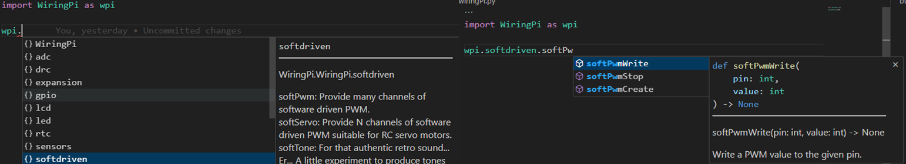
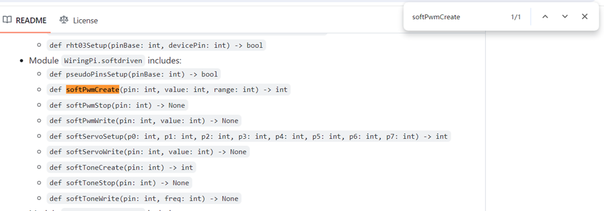

# Pybind11-WiringPi
The python version of WiringPi, that is packaged by Pybind11.


## 1. Installation

If you want to compile this project and generate the wheel file, the compilation and installation process is as follows:
```bash
# Install the dependent packages
sudo pip3 install mypy ninja

# download our project, 'recursive' is indispensable.
git clone --recursive https://github.com/Li-Zhaoxi/Pybind11-WiringPi
cd Pybind11-WiringPi

# Build and install WiringPi-RDK: 
cd 3rdparty/WiringPi-RDK
./build
cd ../..

# Install Pybind11
cd 3rdparty/pybind11
mkdir build && cd build
cmake -DCMAKE_BUILD_TYPE=Release -DBUILD_TESTING=OFF ..
sudo make install
cd ../../..

# Build the wheel of Pybind11-WiringPi
python3 setup.py bdist_wheel

# Install the built package
sudo pip3 install dist/WiringPi*.whl
```
If you want to use the given whl file, please download the wheel from https://github.com/Li-Zhaoxi/Pybind11-WiringPi/releases/, and then the installation process is as follows:
```bash
# download our project, 'recursive' is indispensable.
git clone --recursive https://github.com/Li-Zhaoxi/Pybind11-WiringPi
cd Pybind11-WiringPi

# Build and install WiringPi-RDK: 
cd 3rdparty/WiringPi-RDK
./build
cd ../..

# Install the given wheel
sudo pip3 install <path>/WiringPi-*.whl
```aa

If you can `import WiringPi` correctly,  it means that you have successfully installed this project.


## 2. Usage

After `import WiringPi`, you can directly see all function interfaces and related comments within the package under the development environment of VSCode
<div align="center">
  
</div>

In the section 'Appendix', I have added all interface declarations in each module. If you know the name of the function to be called, you can directly search for the name in README to obtain the way to call this function. For example, the calling method of the `softPwmCreate` function is`from WiringPi.softdrive import softPwmCreate`.
<div align="center">
  
</div>

## 3. Appendix

### 3.1. Packaged APIs

- Module `WiringPi.adc` inclues:
  - `def ads1115Setup(pinBase: int, i2cAddress: int) -> bool` (Source: ads1115.h)
  - `def max31855Setup(pinBase: int, spiChannel: int) -> bool` (Source: max31855.h)
  - `def max5322Setup(pinBase: int, spiChannel: int) -> bool` (Source: max5322.h)
  - `def mcp3002Setup(pinBase: int, spiChannel: int) -> bool` (Source: mcp3002.h)
  - `def mcp3004Setup(pinBase: int, spiChannel: int) -> bool` (Source: mcp3004.h)
  - `def mcp3422Setup(pinBase: int, i2cAddress: int, sampleRate: int, gain: int) -> bool` (Source: mcp3422.h)
  - `def mcp4802Setup(pinBase: int, spiChannel: int) -> bool` (Source: mcp4802.h)
- Module `WiringPi.drc` includes:
  - `def drcSetupNet(pinBase: int, numPins: int, ipAddress: str, port: str, password: str) -> bool` (Source: drcNet.h)
  - `def drcSetupSerial(pinBase: int, numPins: int, device: str, baud: int) -> bool` (Source: drcSerial.h)
- Module `WiringPi.expansion` includes:
  - `def gertboardAnalogRead(chan: int) -> int` (Source: gertboard.h)
  - `def gertboardAnalogSetup(pinBase: int) -> int` (Source: gertboard.h)
  - `def gertboardAnalogWrite(chan: int, value: int) -> None` (Source: gertboard.h)
  - `def gertboardSPISetup() -> int` (Source: gertboard.h)
  - `def piFaceSetup(pinBase: int) -> int` (Source: piFace.h)
  - `def piGlow1(leg: int, ring: int, intensity: int) -> None` (Source: piGlow.h)
  - `def piGlowLeg(leg: int, intensity: int) -> None` (Source: piGlow.h)
  - `def piGlowRing(ring: int, intensity: int) -> None` (Source: piGlow.h)
  - `def piGlowSetup(clear: int) -> None` (Source: piGlow.h)
  - `def readNesJoystick(joystick: int) -> int` (Source: piNes.h)
  - `def scrollPhatClear() -> None` (Source: scrollPhat.h)
  - `def scrollPhatIntensity(percent: int) -> None` (Source: scrollPhat.h)
  - `def scrollPhatLine(x0: int, y0: int, x1: int, y1: int, colour: int) -> None` (Source: scrollPhat.h)
  - `def scrollPhatLineTo(x: int, y: int, colour: int) -> None` (Source: scrollPhat.h)
  - `def scrollPhatPoint(x: int, y: int, colour: int) -> None` (Source: scrollPhat.h)
  - `def scrollPhatPrintSpeed(cps10: int) -> None` (Source: scrollPhat.h)
  - `def scrollPhatPutchar(c: int) -> int` (Source: scrollPhat.h)
  - `def scrollPhatPuts(message: str) -> None` (Source: scrollPhat.h)
  - `def scrollPhatRectangle(x1: int, y1: int, x2: int, y2: int, colour: int, filled: int) -> None` (Source: scrollPhat.h)
  - `def scrollPhatSetup() -> int` (Source: scrollPhat.h)
  - `def scrollPhatUpdate() -> None` (Source: scrollPhat.h)
  - `def setupNesJoystick(dPin: int, cPin: int, lPin: int) -> int` (Source: piNes.h)
  - `MAX_NES_JOYSTICKS: int` (Source: piNes.h)
  - `NES_A: int` (Source: piNes.h)
  - `NES_B: int` (Source: piNes.h)
  - `NES_DOWN: int` (Source: piNes.h)
  - `NES_LEFT: int` (Source: piNes.h)
  - `NES_RIGHT: int` (Source: piNes.h)
  - `NES_SELECT: int` (Source: piNes.h)
  - `NES_START: int` (Source: piNes.h)
  - `NES_UP: int` (Source: piNes.h)
  - `PIGLOW_BLUE: int` (Source: piGlow.h)
  - `PIGLOW_GREEN: int` (Source: piGlow.h)
  - `PIGLOW_ORANGE: int` (Source: piGlow.h)
  - `PIGLOW_RED: int` (Source: piGlow.h)
  - `PIGLOW_WHITE: int` (Source: piGlow.h)
  - `PIGLOW_YELLOW: int` (Source: piGlow.h)
- Module `WiringPi.gpio` includes:
  - `def mcp23008Setup(pinBase: int, i2cAddress: int) -> bool` (Source: mcp23008.h)
  - `def mcp23016Setup(pinBase: int, i2cAddress: int) -> bool` (Source: mcp23016.h)
  - `def mcp23017Setup(pinBase: int, i2cAddress: int) -> bool` (Source: mcp23017.h)
  - `def mcp23s08Setup(pinBase: int, spiPort: int, devId: int) -> bool` (Source: mcp23s08.h)
  - `def mcp23s17Setup(pinBase: int, spiPort: int, devId: int) -> bool` (Source: mcp23s17.h)
  - `def pcf8574Setup(pinBase: int, i2cAddress: int) -> bool` (Source: pcf8574.h)
  - `def pcf8591Setup(pinBase: int, i2cAddress: int) -> bool` (Source: pcf8591.h)
  - `def sr595Setup(pinBase: int, numPins: int, dataPin: int, clockPin: int, latchPin: int) -> None` (Source: sr595.h)
  - `MCP23016_GP0: int` (Source: mcp23016reg.h)
  - `MCP23016_GP1: int` (Source: mcp23016reg.h)
  - `MCP23016_INTCAP0: int` (Source: mcp23016reg.h)
  - `MCP23016_INTCAP1: int` (Source: mcp23016reg.h)
  - `MCP23016_IOCON0: int` (Source: mcp23016reg.h)
  - `MCP23016_IOCON1: int` (Source: mcp23016reg.h)
  - `MCP23016_IOCON_IARES: int` (Source: mcp23016reg.h)
  - `MCP23016_IOCON_INIT: int` (Source: mcp23016reg.h)
  - `MCP23016_IODIR0: int` (Source: mcp23016reg.h)
  - `MCP23016_IODIR1: int` (Source: mcp23016reg.h)
  - `MCP23016_IPOL0: int` (Source: mcp23016reg.h)
  - `MCP23016_IPOL1: int` (Source: mcp23016reg.h)
  - `MCP23016_OLAT0: int` (Source: mcp23016reg.h)
  - `MCP23016_OLAT1: int` (Source: mcp23016reg.h)
  - `MCP23x0817_CMD_READ: int` (Source: mcp23x0817.h)
  - `MCP23x0817_CMD_WRITE: int` (Source: mcp23x0817.h)
  - `MCP23x0817_IOCON_BANK_MODE: int` (Source: mcp23x0817.h)
  - `MCP23x0817_IOCON_DISSLW: int` (Source: mcp23x0817.h)
  - `MCP23x0817_IOCON_HAEN: int` (Source: mcp23x0817.h)
  - `MCP23x0817_IOCON_INIT: int` (Source: mcp23x0817.h)
  - `MCP23x0817_IOCON_INTPOL: int` (Source: mcp23x0817.h)
  - `MCP23x0817_IOCON_MIRROR: int` (Source: mcp23x0817.h)
  - `MCP23x0817_IOCON_ODR: int` (Source: mcp23x0817.h)
  - `MCP23x0817_IOCON_SEQOP: int` (Source: mcp23x0817.h)
  - `MCP23x0817_IOCON_UNUSED: int` (Source: mcp23x0817.h)
  - `MCP23x08_DEFVAL: int` (Source: mcp23x0817.h)
  - `MCP23x08_GPINTEN: int` (Source: mcp23x0817.h)
  - `MCP23x08_GPIO: int` (Source: mcp23x0817.h)
  - `MCP23x08_GPPU: int` (Source: mcp23x0817.h)
  - `MCP23x08_INTCAP: int` (Source: mcp23x0817.h)
  - `MCP23x08_INTCON: int` (Source: mcp23x0817.h)
  - `MCP23x08_INTF: int` (Source: mcp23x0817.h)
  - `MCP23x08_IOCON: int` (Source: mcp23x0817.h)
  - `MCP23x08_IODIR: int` (Source: mcp23x0817.h)
  - `MCP23x08_IPOL: int` (Source: mcp23x0817.h)
  - `MCP23x08_OLAT: int` (Source: mcp23x0817.h)
  - `MCP23x17_CMD_READ: int` (Source: mcp23x0817.h)
  - `MCP23x17_CMD_WRITE: int` (Source: mcp23x0817.h)
  - `MCP23x17_DEFVALA: int` (Source: mcp23x0817.h)
  - `MCP23x17_DEFVALB: int` (Source: mcp23x0817.h)
  - `MCP23x17_GPINTENA: int` (Source: mcp23x0817.h)
  - `MCP23x17_GPINTENB: int` (Source: mcp23x0817.h)
  - `MCP23x17_GPIOA: int` (Source: mcp23x0817.h)
  - `MCP23x17_GPIOB: int` (Source: mcp23x0817.h)
  - `MCP23x17_GPPUA: int` (Source: mcp23x0817.h)
  - `MCP23x17_GPPUB: int` (Source: mcp23x0817.h)
  - `MCP23x17_INTCAPA: int` (Source: mcp23x0817.h)
  - `MCP23x17_INTCAPB: int` (Source: mcp23x0817.h)
  - `MCP23x17_INTCONA: int` (Source: mcp23x0817.h)
  - `MCP23x17_INTCONB: int` (Source: mcp23x0817.h)
  - `MCP23x17_INTFA: int` (Source: mcp23x0817.h)
  - `MCP23x17_INTFB: int` (Source: mcp23x0817.h)
  - `MCP23x17_IOCON: int` (Source: mcp23x0817.h)
  - `MCP23x17_IOCONB: int` (Source: mcp23x0817.h)
  - `MCP23x17_IOCON_BANK_MODE: int` (Source: mcp23x0817.h)
  - `MCP23x17_IOCON_DISSLW: int` (Source: mcp23x0817.h)
  - `MCP23x17_IOCON_HAEN: int` (Source: mcp23x0817.h)
  - `MCP23x17_IOCON_INIT: int` (Source: mcp23x0817.h)
  - `MCP23x17_IOCON_INTPOL: int` (Source: mcp23x0817.h)
  - `MCP23x17_IOCON_MIRROR: int` (Source: mcp23x0817.h)
  - `MCP23x17_IOCON_ODR: int` (Source: mcp23x0817.h)
  - `MCP23x17_IOCON_SEQOP: int` (Source: mcp23x0817.h)
  - `MCP23x17_IOCON_UNUSED: int` (Source: mcp23x0817.h)
  - `MCP23x17_IODIRA: int` (Source: mcp23x0817.h)
  - `MCP23x17_IODIRB: int` (Source: mcp23x0817.h)
  - `MCP23x17_IPOLA: int` (Source: mcp23x0817.h)
  - `MCP23x17_IPOLB: int` (Source: mcp23x0817.h)
  - `MCP23x17_OLATA: int` (Source: mcp23x0817.h)
  - `MCP23x17_OLATB: int` (Source: mcp23x0817.h)
- Module `WiringPi.lcd` includes:
  - `def lcd128x64circle(x: int, y: int, r: int, colour: int, filled: int) -> None` (Source: lcd128x64.h)
  - `def lcd128x64ellipse(cx: int, cy: int, xRadius: int, yRadius: int, colour: int, filled: int) -> None` (Source: lcd128x64.h)
  - `def lcd128x64getScreenSize() -> tuple[int, int]` (Source: lcd128x64.h)
  - `def lcd128x64line(x0: int, y0: int, x1: int, y1: int, colour: int) -> None` (Source: lcd128x64.h)
  - `def lcd128x64lineTo(x: int, y: int, colour: int) -> None` (Source: lcd128x64.h)
  - `def lcd128x64orientCoordinates(x: int, y: int) -> tuple[int, int]` (Source: lcd128x64.h)
  - `def lcd128x64point(x: int, y: int, colour: int) -> None` (Source: lcd128x64.h)
  - `def lcd128x64putchar(x: int, y: int, c: int, bgCol: int, fgCol: int) -> None` (Source: lcd128x64.h)
  - `def lcd128x64puts(x: int, y: int, text: str, bgCol: int, fgCol: int) -> None` (Source: lcd128x64.h)
  - `def lcd128x64rectangle(x1: int, y1: int, x2: int, y2: int, colour: int, filled: int) -> None` (Source: lcd128x64.h)
  - `def lcd128x64setOrientation(orientation: int) -> None` (Source: lcd128x64.h)
  - `def lcd128x64setOrigin(x: int, y: int) -> None` (Source: lcd128x64.h)
  - `def lcd128x64setup() -> int` (Source: lcd128x64.h)
  - `def lcd128x64update() -> None` (Source: lcd128x64.h)
  - `def lcdCharDef(fd: int, index: int, data: numpy.ndarray[numpy.uint8]) -> None` (Source: lcd.h)
  - `def lcdClear(fd: int) -> None` (Source: lcd.h)
  - `def lcdCursor(fd: int, state: int) -> None` (Source: lcd.h)
  - `def lcdCursorBlink(fd: int, state: int) -> None` (Source: lcd.h)
  - `def lcdDisplay(fd: int, state: int) -> None` (Source: lcd.h)
  - `def lcdHome(fd: int) -> None` (Source: lcd.h)
  - `def lcdInit(rows: int, cols: int, bits: int, rs: int, strb: int, d0: int, d1: int, d2: int, d3: int, d4: int, d5: int, d6: int, d7: int) -> int` (Source: lcd.h)
  - `def lcdPosition(fd: int, x: int, y: int) -> None` (Source: lcd.h)
  - `def lcdPutchar(fd: int, data: int) -> None` (Source: lcd.h)
  - `def lcdPuts(fd: int, string: str) -> None` (Source: lcd.h)
  - `def lcdSendCommand(fd: int, command: int) -> None` (Source: lcd.h)
- Module `WiringPi.led` includes:
  - `def sn3218Setup(pinBase: int) -> bool` (Source: sn3218.h)
- Module `WiringPi.rtc` includes:
  - `def ds1302clockRead() -> numpy.ndarray[numpy.int32]` (Source: ds1302.h)
  - `def ds1302clockWrite(clockData: numpy.ndarray[numpy.int32]) -> None` (Source: ds1302.h)
  - `def ds1302ramRead(addr: int) -> int` (Source: ds1302.h)
  - `def ds1302ramWrite(addr: int, data: int) -> None` (Source: ds1302.h)
  - `def ds1302rtcRead(reg: int) -> int` (Source: ds1302.h)
  - `def ds1302rtcWrite(reg: int, data: int) -> None` (Source: ds1302.h)
  - `def ds1302setup(clockPin: int, dataPin: int, csPin: int) -> None` (Source: ds1302.h)
  - `def ds1302trickleCharge(diodes: int, resistors: int) -> None` (Source: ds1302.h)
- Module `WiringPi.sensors` includes:
  - `def bmp180Setup(pinBase: int) -> bool` (Source: bmp180.h)
  - `def ds18b20Setup(pinBase: int, deviceId: str) -> bool` (Source: ds18b20.h)
  - `def htu21dSetup(pinBase: int) -> bool` (Source: htu21d.h)
  - `def maxDetectRead(pin: int) -> std::optional<array_t<unsigned char, 16> >` (Source: maxdetect.h)
  - `def readRHT03(pin: int) -> std::variant<std::tuple<int, int>, none>` (Source: rht03.h)
  - `def rht03Setup(pinBase: int, devicePin: int) -> bool` (Source: rht03.h)
- Module `WiringPi.softdriven` includes:
  - `def pseudoPinsSetup(pinBase: int) -> bool` (Source: pseudoPins.h)
  - `def softPwmCreate(pin: int, value: int, range: int) -> int` (Source: softPwm.h)
  - `def softPwmStop(pin: int) -> None` (Source: softPwm.h)
  - `def softPwmWrite(pin: int, value: int) -> None` (Source: softPwm.h)
  - `def softServoSetup(p0: int, p1: int, p2: int, p3: int, p4: int, p5: int, p6: int, p7: int) -> int` (Source: softServo.h)
  - `def softServoWrite(pin: int, value: int) -> None` (Source: softServo.h)
  - `def softToneCreate(pin: int) -> int` (Source: softTone.h)
  - `def softToneStop(pin: int) -> None` (Source: softTone.h)
  - `def softToneWrite(pin: int, freq: int) -> None` (Source: softTone.h)
- Module `WiringPi.wiring` includes:
  - `def analogRead(pin: int) -> int` (Source: wiringPi.h)
  - `def analogWrite(pin: int, value: int) -> None` (Source: wiringPi.h)
  - `def delay(howLong: int) -> None` (Source: wiringPi.h)
  - `def delayMicroseconds(howLong: int) -> None` (Source: wiringPi.h)
  - `def digitalRead(pin: int) -> int` (Source: wiringPi.h)
  - `def digitalReadByte() -> int` (Source: wiringPi.h)
  - `def digitalReadByte2() -> int` (Source: wiringPi.h)
  - `def digitalWrite(pin: int, value: int) -> None` (Source: wiringPi.h)
  - `def digitalWriteByte(value: int) -> None` (Source: wiringPi.h)
  - `def digitalWriteByte2(value: int) -> None` (Source: wiringPi.h)
  - `def getAlt(pin: int) -> int` (Source: wiringPi.h)
  - `def gpioClockSet(pin: int, freq: int) -> None` (Source: wiringPi.h)
  - `def loadWPiExtension(progName: str, extensionData: str, verbose: int) -> bool` (Source: wpiExtensions.h)
  - `def micros() -> int` (Source: wiringPi.h)
  - `def millis() -> int` (Source: wiringPi.h)
  - `def physPinToGpio(physPin: int) -> int` (Source: wiringPi.h)
  - `def piBoardId() -> tuple[int, int, int, int, int]` (Source: wiringPi.h)
  - `def piGpioLayout() -> int` (Source: wiringPi.h)
  - `def piHiPri(pri: int) -> int` (Source: wiringPi.h)
  - `def piLock(key: int) -> None` (Source: wiringPi.h)
  - `piThreadCreate(fn: std::function<void* (void*)>) -> int` (Source: wiringPi.h)
  - `def piUnlock(key: int) -> None` (Source: wiringPi.h)
  - `def pinMode(pin: int, mode: int) -> None` (Source: wiringPi.h)
  - `def pinModeAlt(pin: int, mode: int) -> None` (Source: wiringPi.h)
  - `def pullUpDnControl(pin: int, pud: int) -> None` (Source: wiringPi.h)
  - `def pwmSetClock(divisor: int) -> None` (Source: wiringPi.h)
  - `def pwmSetDuty(pin: int, duty_cycle_ns: int) -> None` (Source: wiringPi.h)
  - `def pwmSetFreq(pin: int, frequency: int) -> None` (Source: wiringPi.h)
  - `def pwmSetMode(mode: int) -> None` (Source: wiringPi.h)
  - `def pwmSetRange(range: int) -> None` (Source: wiringPi.h)
  - `def pwmToneWrite(pin: int, freq: int) -> None` (Source: wiringPi.h)
  - `def pwmWrite(pin: int, value: int) -> None` (Source: wiringPi.h)
  - `def serialClose(fd: int) -> None` (Source: wiringSerial.h)
  - `def serialDataAvail(fd: int) -> int` (Source: wiringSerial.h)
  - `def serialFlush(fd: int) -> None` (Source: wiringSerial.h)
  - `def serialGetchar(fd: int) -> int` (Source: wiringSerial.h)
  - `def serialOpen(device: str, baud: int) -> int` (Source: wiringSerial.h)
  - `def serialPutchar(fd: int, c: int) -> None` (Source: wiringSerial.h)
  - `def serialPuts(fd: int, message: str) -> None` (Source: wiringSerial.h)
  - `def setPadDrive(group: int, value: int) -> None` (Source: wiringPi.h)
  - `def shiftIn(dPin: int, cPin: int, order: int) -> int` (Source: wiringShift.h)
  - `def shiftOut(dPin: int, cPin: int, order: int, val: int) -> None` (Source: wiringShift.h)
  - `def waitForInterrupt(pin: int, mS: int) -> int` (Source: wiringPi.h)
  - `def wiringPiFailure(fatal: int, message: str) -> int` (Source: wiringPi.h)
  - `def wiringPiI2CRead(fd: int) -> int` (Source: wiringPiI2C.h)
  - `def wiringPiI2CReadReg16(fd: int, reg: int) -> int` (Source: wiringPiI2C.h)
  - `def wiringPiI2CReadReg8(fd: int, reg: int) -> int` (Source: wiringPiI2C.h)
  - `def wiringPiI2CSetup(devId: int) -> int` (Source: wiringPiI2C.h)
  - `def wiringPiI2CSetupInterface(device: str, devId: int) -> int` (Source: wiringPiI2C.h)
  - `def wiringPiI2CWrite(fd: int, data: int) -> int` (Source: wiringPiI2C.h)
  - `def wiringPiI2CWriteReg16(fd: int, reg: int, data: int) -> int` (Source: wiringPiI2C.h)
  - `def wiringPiI2CWriteReg8(fd: int, reg: int, data: int) -> int` (Source: wiringPiI2C.h)
  - `def wiringPiISR(pin: int, mode: int, function) -> int` (Source: wiringPi.h)
  - `def wiringPiSPIDataRW(channel: int, data: int, len: int) -> int` (Source: wiringPiSPI.h)
  - `def wiringPiSPIGetFd(channel: int) -> int` (Source: wiringPiSPI.h)
  - `def wiringPiSPISetup(channel: int, speed: int) -> int` (Source: wiringPiSPI.h)
  - `def wiringPiSPISetupMode(channel: int, speed: int, mode: int) -> int` (Source: wiringPiSPI.h)
  - `def wiringPiSetup() -> int` (Source: wiringPi.h)
  - `def wiringPiSetupGpio() -> int` (Source: wiringPi.h)
  - `def wiringPiSetupPhys() -> int` (Source: wiringPi.h)
  - `def wiringPiSetupSys() -> int` (Source: wiringPi.h)
  - `def wiringPiVersion() -> tuple[int, int]` (Source: wiringPi.h)
  - `def wpiPinToGpio(wpiPin: int) -> int` (Source: wiringPi.h)
  - `GPIO_CLOCK: int` (Source: wiringPi.h)
  - `HIGH: int` (Source: wiringPi.h)
  - `INPUT: int` (Source: wiringPi.h)
  - `INT_EDGE_BOTH: int` (Source: wiringPi.h)
  - `INT_EDGE_FALLING: int` (Source: wiringPi.h)
  - `INT_EDGE_RISING: int` (Source: wiringPi.h)
  - `INT_EDGE_SETUP: int` (Source: wiringPi.h)
  - `LOW: int` (Source: wiringPi.h)
  - `NOTD: int` (Source: wiringPi.h)
  - `OUTPUT: int` (Source: wiringPi.h)
  - `PI_ALPHA: int` (Source: wiringPi.h)
  - `PI_GPIO_MASK: int` (Source: wiringPi.h)
  - `PI_MAKER_EGOMAN: int` (Source: wiringPi.h)
  - `PI_MAKER_EMBEST: int` (Source: wiringPi.h)
  - `PI_MAKER_HORIZON: int` (Source: wiringPi.h)
  - `PI_MAKER_SONY: int` (Source: wiringPi.h)
  - `PI_MAKER_UNKNOWN: int` (Source: wiringPi.h)
  - `PI_MODEL_07: int` (Source: wiringPi.h)
  - `PI_MODEL_2: int` (Source: wiringPi.h)
  - `PI_MODEL_3AP: int` (Source: wiringPi.h)
  - `PI_MODEL_3B: int` (Source: wiringPi.h)
  - `PI_MODEL_3BP: int` (Source: wiringPi.h)
  - `PI_MODEL_400: int` (Source: wiringPi.h)
  - `PI_MODEL_4B: int` (Source: wiringPi.h)
  - `PI_MODEL_A: int` (Source: wiringPi.h)
  - `PI_MODEL_AP: int` (Source: wiringPi.h)
  - `PI_MODEL_B: int` (Source: wiringPi.h)
  - `PI_MODEL_BP: int` (Source: wiringPi.h)
  - `PI_MODEL_CM: int` (Source: wiringPi.h)
  - `PI_MODEL_CM3: int` (Source: wiringPi.h)
  - `PI_MODEL_CM3P: int` (Source: wiringPi.h)
  - `PI_MODEL_CM4: int` (Source: wiringPi.h)
  - `PI_MODEL_RDKX3: int` (Source: wiringPi.h)
  - `PI_MODEL_RDKX3MD: int` (Source: wiringPi.h)
  - `PI_MODEL_RDKX3V1_2: int` (Source: wiringPi.h)
  - `PI_MODEL_RDKX3V2: int` (Source: wiringPi.h)
  - `PI_MODEL_SDB: int` (Source: wiringPi.h)
  - `PI_MODEL_ZERO: int` (Source: wiringPi.h)
  - `PI_MODEL_ZERO_2W: int` (Source: wiringPi.h)
  - `PI_MODEL_ZERO_W: int` (Source: wiringPi.h)
  - `PI_VERSION_1: int` (Source: wiringPi.h)
  - `PI_VERSION_1_1: int` (Source: wiringPi.h)
  - `PI_VERSION_1_2: int` (Source: wiringPi.h)
  - `PI_VERSION_2: int` (Source: wiringPi.h)
  - `PI_VERSION_3: int` (Source: wiringPi.h)
  - `PI_VERSION_4: int` (Source: wiringPi.h)
  - `PUD_DOWN: int` (Source: wiringPi.h)
  - `PUD_OFF: int` (Source: wiringPi.h)
  - `PUD_UP: int` (Source: wiringPi.h)
  - `PWM_MODE_BAL: int` (Source: wiringPi.h)
  - `PWM_MODE_MS: int` (Source: wiringPi.h)
  - `PWM_OUTPUT: int` (Source: wiringPi.h)
  - `PWM_TONE_OUTPUT: int` (Source: wiringPi.h)
  - `SOFT_PWM_OUTPUT: int` (Source: wiringPi.h)
  - `SOFT_TONE_OUTPUT: int` (Source: wiringPi.h)
  - `WPI_MODE_GPIO: int` (Source: wiringPi.h)
  - `WPI_MODE_GPIO_SYS: int` (Source: wiringPi.h)
  - `WPI_MODE_PHYS: int` (Source: wiringPi.h)
  - `WPI_MODE_PIFACE: int` (Source: wiringPi.h)
  - `WPI_MODE_PINS: int` (Source: wiringPi.h)
  - `WPI_MODE_UNINITIALISED: int` (Source: wiringPi.h)


